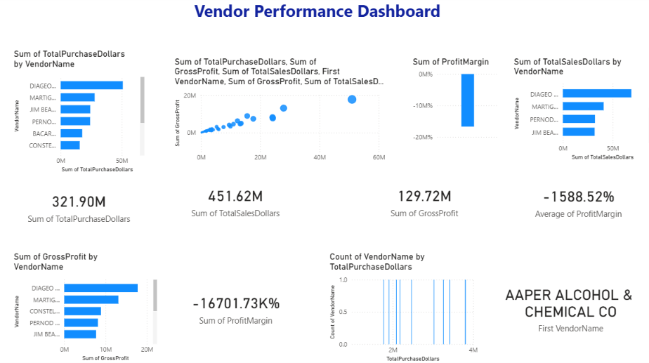
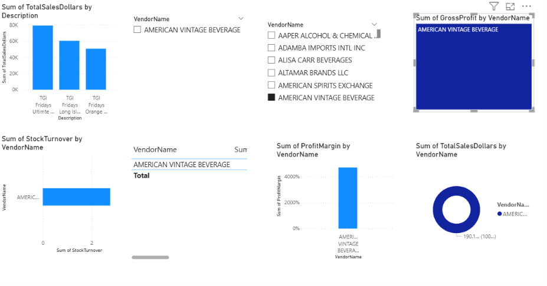

# 📊 Vendor Performance Analysis Dashboard

<p align="center">
  
  
  
  
</p>

---

## 📌 Project Overview

This project presents an **interactive Vendor Performance Dashboard** developed using **Power BI**.

The dashboard helps businesses monitor vendor performance by analyzing:

- 💰 Total Sales
- 🛒 Total Purchases
- 📈 Gross Profit
- 📦 Stock Turnover
- 🏆 Top Performing Vendors
- 🏷️ Brand-wise Performance

The dashboard is fully interactive and enables users to filter vendors dynamically using slicers.

---

# 🖼 Dashboard Preview

## 📍 Overview Dashboard

.

---

## 📍 Detailed Analysis Dashboard



---

# 🚀 Features

✅ Interactive Power BI Dashboard

✅ Vendor-wise Filtering (Slicer)

✅ KPI Cards

✅ Gross Profit Analysis

✅ Purchase Analysis

✅ Sales Analysis

✅ Brand-wise Performance

✅ Stock Turnover Analysis

✅ Top Vendors Comparison

✅ Interactive Charts

---

# 🛠 Tech Stack

| Tool | Purpose |
|------|----------|
| Power BI | Dashboard Development |
| Python | Data Processing |
| Pandas | Data Cleaning |
| SQLite | Data Storage |
| CSV | Dataset |

---

# 📂 Project Structure

```
Vendor-Performance-Analysis/
│
├── Vendor_Performance_Dashboard.pbix
├── vendor_sales_summary.csv
├── dashboard_page1.png
├── dashboard_page2.png
├── README.md
└── LICENSE
```

---

# 📊 Dashboard KPIs

- Total Purchase Dollars
- Total Sales Dollars
- Gross Profit
- Profit Margin
- Stock Turnover
- Vendor Performance

---

# 📈 Visualizations Used

- KPI Cards
- Bar Chart
- Column Chart
- Scatter Chart
- Treemap
- Table
- Slicer

---

# 💡 Business Insights

- Identify top-performing vendors.
- Compare vendor profitability.
- Analyze purchase and sales trends.
- Track stock turnover.
- Monitor gross profit.
- Support better purchasing decisions.

---

# 🎯 Future Improvements

- SQL Live Database Integration
- Automated Data Refresh
- Predictive Analytics
- Sales Forecasting
- Inventory Optimization

---

# 📥 Dataset

The dashboard uses a cleaned vendor sales dataset in CSV format.

---

# ▶️ How to Open

1. Download the repository.
2. Open `Vendor_Performance_Dashboard.pbix` in Power BI Desktop.
3. Interact with the dashboard using slicers and filters.

---

# 👨‍💻 Author

**Yash Garg**

B.Tech Information Technology

---

⭐ If you found this project useful, don't forget to Star the repository!
